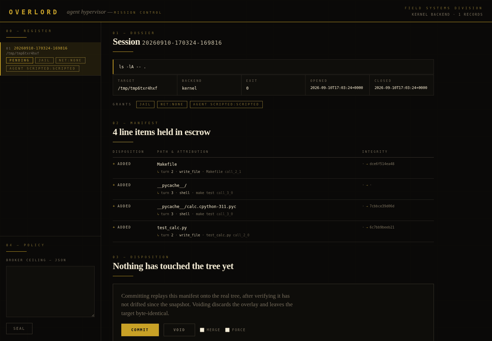

# OVERLORD

An agent hypervisor — the trust kernel for delegated computing.


## Thesis

Computing is transitioning to a new operator: machine agents. The OS has no native
concept of a machine actor. Every agent today runs with its principal's full authority
on infrastructure that cannot distinguish the principal's intent from the agent's
behavior. Every harness vendor duct-tapes around this independently and badly.

OVERLORD is the missing layer between the agent harness and the operating system.
Not an AI. Model-agnostic. A boring, load-bearing primitive — the SQLite pattern,
not the Windows pattern.

## The Four Primitives

1. **Capability, not identity** — an agent receives a scoped grant (paths, budget,
   network egress, time window), not a user account. Commander's intent expressed
   as kernel-enforced constraints.
2. **Provenance** — every mutation traceable to actor, instruction, and the reasoning
   artifact that caused it. A flight recorder for machine action.
3. **Reversibility** — agent action is transactional: snapshot, execute, inspect,
   commit or roll back. The keystone. Delegation is blocked on "what if it breaks
   something"; this removes the question.
4. **Arbitration** — when N agents contend for a resource, authority is scheduled
   the way CPU is scheduled.

## Install

```bash
sudo bash packaging/install.sh
overlord doctor
```

Installs the engine to `/usr/local/lib/overlord/`, a compiled ELF launcher to
`/usr/local/bin/overlord` (the AppArmor attachment point), the AppArmor profile
that enables the kernel backend on Ubuntu 24.04+, and the runtime deps
(`fuse-overlayfs`, `strace`).

## Use

```bash
overlord run -t /srv/app -- some-agent --do-things   # transactional execution
overlord run --jail --net none --timeout 300 -t /srv/app -- <cmd>   # scoped grants
overlord run --manifest cap.json -t /srv/app -- <cmd>               # grants from file
overlord run --trace -t /srv/app -- <cmd>            # + syscall flight recorder (strace)
overlord run --trace ebpf -t /srv/app -- <cmd>       # kernel-side recorder (root-only)
overlord run --merge-base -t /srv/app -- <cmd>       # keep base copy for commit --merge
overlord shell -t /srv/app                           # interactive transactional shell

overlord agent -t /srv/app "add a Makefile with a test target"   # jailed by default
overlord agent --net none -t /srv/app "<task>"       # ...and offline too
overlord agent --no-jail -t /srv/app "<task>"        # opt out: tools reach the real fs

overlord sessions                # pending/committed history with command provenance
overlord diff <session>          # added / modified / deleted / replaced-dir
overlord log <session>           # per-change sha256 before -> after, syscall count
overlord commit <session>        # verify no external drift, replay onto real tree
overlord commit --merge <sess>   # three-way merge non-overlapping drift (needs --merge-base)
overlord commit --force <sess>   # commit despite drift (explicit override)
overlord rollback <session>      # discard — target byte-identical
overlord doctor                  # backend / dependency diagnostics
```

The wrapped command sees a fully writable tree and exits believing everything
happened. Nothing touches the real tree until `commit`. Commit re-verifies the
snapshot fingerprints (size + mtime_ns of every file) and **refuses to clobber
external changes** made while the session was pending. If the session was run
with `--merge-base`, `commit --merge` three-way merges non-overlapping drift
(git merge-file against the kept base) and still refuses overlapping edits.

## Grants (the capability manifest)

Grants scope what a session may do — commander's intent as enforced constraints.
Set via flags or a JSON manifest (`--manifest cap.json`, flags override):

```json
{ "jail": true, "net": "none", "timeout": 300, "merge_base": false }
```

- **jail** — pivot_root jail: the process sees system dirs (ro by real perms),
  a private /tmp and /proc, and the target. `$HOME`, `/mnt`, and the rest of
  the filesystem *do not exist*. Kernel backend only.
- **net: none** — private empty network namespace. No egress, no loopback to
  host services. Kernel backend only.
- **timeout** — hard wall-clock limit; the process group is killed (exit 124).
- **merge_base** — keep a base copy (`cp --reflink=auto`) enabling `commit --merge`.

Arbitration: one executing session per target (flock; `--wait` queues), and a
new session is refused while another is pending on the same target (`--stack`
overrides).

## Mission control (web UI)

```bash
overlord ui          # http://127.0.0.1:7777 — localhost only
```



The review moment for human eyes, rendered as a document of record rather than
a dashboard. The register indexes sessions; the dossier is the instrument a
human signs: the grant envelope the session ran under, a manifest of every
changed path with its before → after hashes and the tool call that caused it,
and the disposition — commit or void. Zero dependencies (stdlib http server),
server-rendered first paint, binds 127.0.0.1 only.

## Resident mode: daemon, policy, SDK

`overlord daemon` (or the systemd unit in packaging/) makes OVERLORD a
resident broker on a 0600 unix socket. Sessions requested through it are
bound by `~/.overlord/policy.json` — deny-by-default targets, forced jail/net,
timeout caps, force-commit gating — and callers can never obtain a looser
scope than policy grants. The Python SDK (`overlord_client.py`, installed to
/usr/local/lib/overlord/) embeds this in any harness: `run() -> Session`,
`session.diff/log/commit/rollback`. See docs/INTEGRATION.md.

## Red team

`test/redteam.sh` attacks the jail: symlink escape, dotdot traversal,
session-record tampering, host sysctl writes, device forgery, host pid
visibility, real-fs reads, overlay-internals reach, fd leaks, mount games.
Finding A3 (session records reachable via the strace bind) was found by this
suite and fixed — records are never exposed; strace gets an isolated trace/
bind only when in use. Every future breach becomes a fix + regression test.

## Backends

| | containment | privileges |
|---|---|---|
| **kernel** | full — overlay is mounted over the target's own path inside a private mount namespace, so absolute-path writes into the target are contained | needs userns capability grants; on Ubuntu 24.04+ the shipped AppArmor profile provides exactly this, scoped to the overlord binary only |
| **fuse** | cooperative — command runs with cwd inside the overlay; absolute-path writes to the real target are **not** intercepted | none |

Auto-detected, kernel preferred. `overlord doctor` shows what's active.

**Containment scope:** without `--jail`, the transactional guarantee covers the
target tree only — the command can still write elsewhere on the filesystem.
With `--jail` (kernel backend), the rest of the filesystem does not exist for
the process; add `--net none` to remove the network as well.

## Provenance

Every session records `provenance.jsonl` — one record per change with sha256
before (lower) and after (upper), which survives commit. With `--trace`, a
syscall-level record (`syscalls.jsonl`: exec, file mutation, connect, per pid,
timestamped) is captured via strace. `--trace ebpf` uses the bpftrace recorder
instead (installed to /usr/local/lib/overlord/provenance.bt) — lower overhead
and unfakeable by the traced process, but root-only and with a known
attach-race at process start.

## Test

```bash
bash test/smoke.sh                # 19 core transactional assertions
bash test/redteam.sh              # 10 jail escape attempts (kernel backend)
python3 test/daemon_sdk_test.py   # 15 daemon + SDK + policy + live-session assertions
python3 test/agent_test.py        # 10 agent loop, tool, provenance, and jail-default assertions
python3 test/ui_test.py           # 9 mission-control API + origin-guard assertions
python3 test/ui_browser_test.py   # 8 mission-control DOM assertions (needs playwright)
```

`ui_test.py` drives the HTTP API; `ui_browser_test.py` loads the page in
Chromium and asserts on the rendered DOM — console errors, the dossier
swapping on a register click, attribution reaching the manifest, the drift
refusal, keyboard navigation, and phone-width layout. The browser suite skips
cleanly when Playwright or Chromium is absent, so it never blocks a bare
checkout; it exists because an API-only UI test let a click-breaking
ReferenceError ship undetected.

Core suite (`smoke.sh`): isolation, diff completeness, provenance hashes,
byte-identical rollback, exact-replay commit, commit finality, conflict refusal
+ `--force`, create-collision refusal, shell, syscall trace, absolute-path
containment, mode-000 cleanup, timeout, manifest, arbitration, three-way merge,
jail sealing, net:none isolation. Kernel-only tests self-skip where userns
grants are absent.

## Roadmap

- fine-grained path grants (extra read-only / writable mounts in the jail)
- token/cost budget grants for LLM-backed agents
- eBPF recorder hardening (attach-race close, structured output)
- multi-target sessions; cross-target atomic commit

## Status

- 2026-09-01 — repo created; thesis.
- 2026-09-01 — v0: transactional run/diff/commit/rollback, dual backend, e2e suite.
- 2026-09-01 — v0.1: conflict detection, provenance flight recorder (hashes +
  strace), interactive shell, kernel-backend overmount containment, AppArmor
  packaging, installer.
- 2026-09-01 — v0.2: capability manifests (jail / net / timeout), pivot_root
  jail, network scoping, arbitration (locks + pending guard), three-way merge
  on commit, eBPF recorder wired (`--trace ebpf`, root-only).
- 2026-09-01 — v0.3: red team suite (10 attacks; found + fixed A3 session-record
  exposure), resident daemon with policy brokering (deny-by-default, grant caps,
  force gating), Python SDK, systemd unit, integration docs.
- 2026-09-01 — v0.4: mission control web UI (`overlord ui`) — session review,
  per-file diff with hashes, one-click commit/rollback, policy editor;
  zero-dependency, server-rendered, localhost-only.
