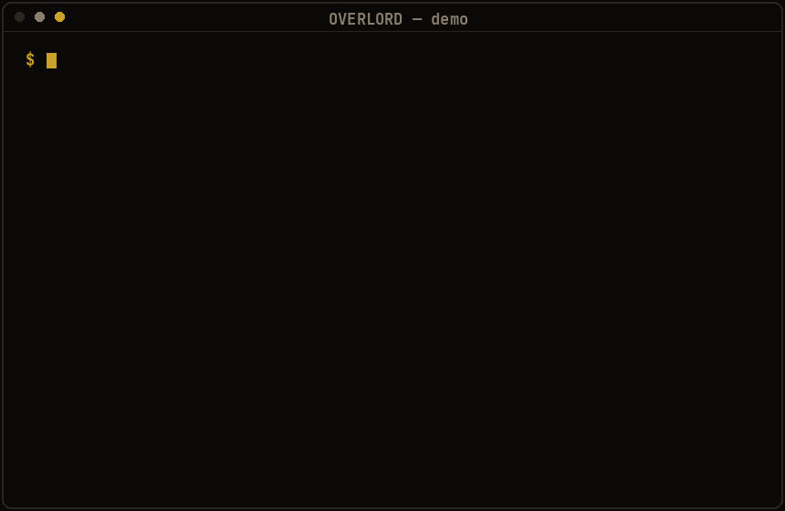

# OVERLORD

An agent hypervisor — the trust kernel for delegated computing.



Hand a program — or an AI agent — a fully writable copy of a directory. Let it
run. Then review every change it made as a hashed, attributed manifest and
**commit or roll back**, all or nothing. Transactional isolation, provenance,
and arbitration for untrusted execution — in dependency-free Python, on the
kernel's own primitives. It ships with a built-in agent (`overlord agent`) that
runs a model with its hands jailed, so you can watch the whole loop happen
inside the transaction and sign off on the diff. For people who just want to
use it, `overlord ui` opens a chat workspace where you talk to that agent and
press Commit when you like what it did — nothing on disk changes until you do.

## Thesis

Computing is transitioning to a new operator: machine agents. The OS has no native
concept of a machine actor. Every agent today runs with its principal's full authority
on infrastructure that cannot distinguish the principal's intent from the agent's
behavior. Every harness vendor duct-tapes around this independently and badly.

OVERLORD is the missing layer between the agent harness and the operating system.
Not an AI. Model-agnostic. A boring, load-bearing primitive — the SQLite pattern,
not the Windows pattern.

## The Four Primitives

1. **Capability, not identity** — an agent receives a scoped grant (paths, budget,
   network egress, time window), not a user account. Commander's intent expressed
   as kernel-enforced constraints.
2. **Provenance** — every mutation traceable to actor, instruction, and the reasoning
   artifact that caused it. A flight recorder for machine action.
3. **Reversibility** — agent action is transactional: snapshot, execute, inspect,
   commit or roll back. The keystone. Delegation is blocked on "what if it breaks
   something"; this removes the question.
4. **Arbitration** — when N agents contend for a resource, authority is scheduled
   the way CPU is scheduled.

## Install

```bash
sudo bash packaging/install.sh
overlord doctor
```

Installs the engine to `/usr/local/lib/overlord/`, a compiled ELF launcher to
`/usr/local/bin/overlord` (the AppArmor attachment point), the AppArmor profile
that enables the kernel backend on Ubuntu 24.04+, and the runtime deps
(`fuse-overlayfs`, `strace`).

### Windows and macOS

The engine is Linux kernel machinery — overlayfs, user namespaces,
`mount(2)` — so OVERLORD does not run natively on Windows or macOS, and a
port would be a different product. It runs in the Linux those systems
ship or host:

- **WSL2** (Windows): `wsl --install -d Ubuntu`, then the install above
  inside Ubuntu (the AppArmor step skips itself) and `overlord ui`; WSL2
  forwards localhost, so a Windows browser opens `http://127.0.0.1:7777`.
  Keep the project folder in the Linux filesystem (`~/projects/…`, seen
  from Windows as `\\wsl$\Ubuntu\home\…`), not under `/mnt/c/`, where
  the overlay is slow and `doctor` may fall back to the fuse backend.
- **Docker Desktop** (Windows, macOS): the `Dockerfile` builds an image on
  the fuse backend; its header has the run line (`--device /dev/fuse
  --cap-add SYS_ADMIN`, a data volume, accounts and a certificate first).

On WSL2 the per-session systemd user scope is skipped automatically (its user
D-Bus is unreliable and would stall sessions with "Failed to connect to bus");
limits fall back to rlimits, and `OVERLORD_NO_SYSTEMD=1` forces that anywhere.

`overlord doctor` is the ground truth on any machine: it names the
backend it found and what each grant will mean there.

## Use

```bash
overlord run -t /srv/app -- some-agent --do-things   # transactional execution
overlord run --jail --net none --timeout 300 -t /srv/app -- <cmd>   # scoped grants
overlord run --manifest cap.json -t /srv/app -- <cmd>               # grants from file
overlord run --trace -t /srv/app -- <cmd>            # + syscall flight recorder (strace)
overlord run --trace ebpf -t /srv/app -- <cmd>       # kernel-side recorder (root-only)
overlord run --merge-base -t /srv/app -- <cmd>       # keep base copy for commit --merge
overlord shell -t /srv/app                           # interactive transactional shell

overlord agent -t /srv/app "add a Makefile with a test target"   # jailed by default
overlord agent --net none -t /srv/app "<task>"       # ...and offline too
overlord agent --net proxy --net-allow github.com --net-allow "*.pypi.org" -t /srv/app "<task>"  # recorded, allowlisted egress
overlord agent --no-jail -t /srv/app "<task>"        # opt out: tools reach the real fs
overlord agent --provider openai-compatible --base-url http://127.0.0.1:11434/v1 \
               --model llama3 -t /srv/app "<task>"   # a local model, same jail
overlord agent --effort xhigh --max-tokens 64000 -t /srv/app "<task>"   # generation knobs
overlord models --provider anthropic                 # what the endpoint serves right now
overlord mcp add github --command npx --arg -y --arg @modelcontextprotocol/server-github \
                 --env GITHUB_TOKEN=…                # register an MCP connector (stdio)
overlord mcp add docs --url https://host/mcp --header 'Authorization: Bearer …'   # (http)
overlord agent --connector github -t /srv/app "<task>"   # grant it; actions ask you first
overlord agent --audit -t /srv/app ["focus"]         # containment audit of its own jail
overlord memory show -t /srv/app                     # what the agent is told before message one
overlord memory user --add "Prefers pytest."         # a note about you, across every folder
overlord memory accept <session> --all               # keep the notes an agent proposed
overlord users add alice --role admin                # accounts: the UI now asks who you are
overlord tls selfsign --host overlord.lan            # a certificate for --bind
overlord sso set --issuer https://login.example.com --client-id … --client-secret-stdin \
    --domain example.com --admin alice@example.com   # OpenID Connect; accounts provisioned on sign-in
overlord ui --bind 0.0.0.0 --tls-cert ~/.overlord/tls/cert.pem --tls-key ~/.overlord/tls/key.pem
overlord skills add skills/python-testing            # packaged know-how, loaded when it fits
overlord skills new release -t /srv/app              # a project skill: part of the tree, reviewed like code
overlord webhooks add team https://hooks.slack.com/… # tell the channel when work waits for a person
overlord secrets set-command 'vault kv get -field=value secret/overlord/{name}'   # then secret://NAME anywhere
overlord export <session> -o review.ovl              # one signed file: record, retained versions, pending changes
overlord import review.ovl -t /srv/app               # replay its changes here as a new pending session
overlord cost                                        # what the models spent, by model / account / day
overlord cost budget --day-usd 20 --month-usd 500    # lines no conversation crosses
overlord audit verify                                # walk the signed chain
overlord audit checkpoint pin.json                   # witness the head off-box
overlord audit verify --pin pin.json                 # prove the live log still carries it
overlord audit witness https://witness.example/log --auto   # send a signed head off-box on every act
overlord audit verify --witness                      # check the live log against the witnessed head
overlord audit verify                                # the hash chain of every consequential act
overlord gc --dry-run                                # what retention would prune

overlord sessions                # pending/committed history with command provenance
overlord diff <session>          # added / modified / deleted / replaced-dir
overlord log <session>           # per-change sha256 before -> after, syscall count
overlord savepoints <session>    # the layer stack: one savepoint per command that wrote
overlord rewind <session> --to 3 # discard everything above savepoint @3
overlord resume <session> --note "..."   # agent carries on from there, reading the note
overlord fork <session> --at 3   # a second continuation of the same moment, as a new session
overlord compare <sess-a> <sess-b>   # where two continuations diverge, per path
overlord review <session> --provider openai   # a second model countersigns the diff
overlord commit <session>        # verify no external drift, replay onto real tree
overlord commit --countersigned <sess>       # ...only with a fresh approval on record
overlord commit --drop tool:shell <sess>     # replay all but the shell tool's layers
overlord commit --only turn:2-4 <sess>       # replay only what turns 2–4 did
overlord commit --merge <sess>   # three-way merge non-overlapping drift (needs --merge-base)
overlord commit --force <sess>   # commit despite drift (explicit override)
overlord rollback <session>      # discard — target byte-identical
overlord revert <session>        # undo a COMMITTED session as a new reviewable session
overlord blame <path>            # which session, turn, tool call, instruction put each line here
overlord doctor                  # backend / dependency diagnostics
```

The wrapped command sees a fully writable tree and exits believing everything
happened. Nothing touches the real tree until `commit`. Commit re-verifies the
snapshot fingerprints (size + mtime_ns of every file) and **refuses to clobber
external changes** made while the session was pending. If the session was run
with `--merge-base`, `commit --merge` three-way merges non-overlapping drift
(git merge-file against the kept base) and still refuses overlapping edits.

## Models

The model thinks on your machine; only its hands are jailed. Every way to
reach one is in `providers.py`, stdlib only, behind one contract, and the
workspace, the CLI, the daemon and the SDK all share it:

| provider | reaches | auth |
|---|---|---|
| `anthropic` | Claude, native Messages API: streaming, adaptive thinking, `effort`, refusal handling, opt-in server-side refusal fallbacks | `ANTHROPIC_API_KEY` or the key store |
| `openai` | OpenAI Responses API (`/v1/responses`): streaming, `reasoning.effort`, function tools with reasoning, encrypted reasoning carried across tool turns, nothing stored server-side; `--api chat` for the old shape | `OPENAI_API_KEY` |
| `azure` | Azure OpenAI deployments (`--base-url https://<resource>.openai.azure.com`, deployment as the model, `--azure-api-version`) | `AZURE_OPENAI_API_KEY` |
| `openai-compatible` | anything speaking the Chat Completions shape behind a base URL: Ollama, vLLM, LiteLLM, Groq, Together, your gateway; `--api responses` once it grows the new shape | optional |
| `gemini` | Google Gemini REST: streaming, function calling | `GEMINI_API_KEY` |

Every provider takes a **base URL** and **extra headers**, which is how a
proxy or an enterprise gateway sits in front of it. `overlord models` lists
what an endpoint serves right now, and the workspace's Settings shows the same
list. Keys live in `~/.overlord/keys.json` (mode 600); environment variables
win over the store.

**Generation knobs** — `--max-tokens`, `--temperature`, `--top-p`, `--stop`,
`--effort low|medium|high|xhigh|max`, `--thinking summarized|off`,
`--api responses|chat`, `--system` (appended instructions), `--no-stream`,
`--no-fallbacks` — are
model-aware: nothing is sent unless you set it. That matters because the
current Claude family rejects `temperature` and `top_p` outright and takes
its depth from `effort`; blank means the model's own default. Replies stream
as they are generated (the CLI prints them live; the workspace renders them
into the bubble), tool inputs that stream in are parsed strictly and handed
back as an error rather than run when malformed, and a reply cut off at
`max_tokens` or declined by a safety classifier never executes its tool
calls. The knobs and the endpoint a conversation ran with are recorded on
the session, so `resume` uses the same model the same way.

## Connectors (MCP)

`mcp.py` is a Model Context Protocol client, stdlib only: stdio servers
(a command) and streamable-HTTP servers (a URL), configured in
`~/.overlord/mcp.json`. Their tools are offered to the model next to the
built-ins, namespaced `mcp__<server>__<tool>`, and a call is routed back to
the server that owns it.

Connectors are different from everything else here, and the design says so:

- **They run on the host, outside the jail and outside the transaction.** A
  connector that sends an email has sent it; Discard cannot unsend it. So a
  session must be *granted* each connector by name (`--connector`, or the
  checkboxes on a new conversation), policy can list the connectors a
  brokered session may have (`"connectors": ["github"]` or `"*"`), and every
  call is written to the transcript with the server that served it and shown
  to the countersigning reviewer as an **external action**.
- **Actions ask first.** A tool declares itself read-only through MCP's
  `readOnlyHint`; anything else goes through the approval gate. In `ask` mode
  (the default) the run pauses: the CLI prompts on the terminal, the
  workspace shows an approval card with the exact input, a brokered run with
  no one to ask is denied. `auto` allows, `readonly` refuses every action.
  Each decision is recorded in the transcript.
- **The call is bound into the record, like a commit.** Because it cannot be
  rolled back, each connector call is written to the keyed audit chain, not
  only the transcript: `connector.call` names it by a fingerprint of the
  server, tool and arguments; `connector.decision` carries that fingerprint
  and, when a person approved, the account that approved it; `connector.result`
  records the result's hash and size. So an approval authorizes one exact
  call — a different call has a different fingerprint — and the whole effect
  is tamper-evident under the audit key.
- A stdio server gets only the environment you configure for it plus PATH,
  HOME and LANG, never the whole process environment, so one connector's
  token is not another's. `overlord mcp test <name>` connects and lists its
  tools with their read-only status.

## Memory

What the agent knows before your first message, and how that is allowed to
change (`memory.py`). Three sources, all injected into the system prompt,
all capped, and the session records what the model was told:

- **Project notes** — `OVERLORD.md` at the root of the working folder:
  conventions, commands, things learned about this codebase. The agent may
  extend it with the `remember` tool, **inside the transaction**: the note is
  a file change in the diff with a savepoint and a cause, committed or
  discarded with everything else. Memory is a file the person reviews.
- **Your notes** — `~/.overlord/memory.md`, about you and your preferences,
  across every folder. The agent cannot write it. `remember` with scope
  `user` only *proposes* a note; you accept it (a Save button in the
  workspace, `overlord memory accept` on the CLI) and the acceptance is
  recorded in that session's transcript.
- **The journal** — one line per committed agent session in a folder: the
  task, what the model said it did, which files changed. Derived from the
  engine's own records at commit time, never written by the model, so
  "recent work in this folder" is always true. Rolled-back sessions and
  plain command sessions leave no entry.

Nothing outside a transaction changes without a human hand, which is the
same rule as everywhere else in OVERLORD.

## Accounts, TLS, a team on one machine

`overlord ui` binds loopback with no accounts: the person at the keyboard
is the operator — proven by a **launch token**, not by loopback. Red team
A13: a session granted `net: host` shares the host's loopback, so
"reachable on 127.0.0.1" would include the agent, which could then read
every session and commit its own. `overlord ui` prints
`http://127.0.0.1:7777/?token=…`; the token lives in `~/.overlord/ui.token`
(mode 600, outside the jail), the page keeps it as a strict cookie, scripts
send it as `Authorization: Bearer`, and a request with neither is refused. The first `overlord users add` turns
sign-in on (`auth.py`), and from then on every request names a principal —
a login cookie (HttpOnly, SameSite=Strict, Secure under TLS) or a bearer
token for scripts (`Authorization: Bearer ovl_…`, hashed at rest,
revocable one by one, `overlord users token`). Five wrong passwords in five
minutes lock that address+name for a minute; passwords are scrypt hashes in
a mode-600 file.

Three roles, checked on every route:

| role | may |
|---|---|
| **admin** | everything: accounts, policy, connector config, every record on the machine |
| **operator** | their own conversations — start, commit, discard, rewind, fork, review — and their own settings, API keys and notes; connectors may be used, not configured |
| **viewer** | read every record, change nothing (an auditor) |

Each account has its own `~/.overlord/users/<name>/` with its `ui.json`,
`keys.json` (a key you set is yours; the machine's shared key is the
fallback an admin can provision) and `memory.md`. A session records its
`owner`; sessions opened from the CLI have none and are the admin's to see.

**Single sign-on** (`oidc.py`): OpenID Connect, authorization code with
PKCE, state and nonce. `overlord sso set` names the issuer and client;
accounts are provisioned on first sign-in when the e-mail domain is
allowed, with the role from a listed e-mail (`--admin`, `--viewer`), a
groups claim (`--role-claim groups --role-map auditors=viewer`) or the
default. SSO accounts have no password and the password form refuses
them; local accounts coexist. What the trust rests on, stated plainly:
the TLS channel to the provider's token and userinfo endpoints plus the
state / nonce / PKCE round-trip — the ID token's claims are checked, its
signature is not (no RSA in the standard library), and the same identity
is confirmed by `userinfo` directly from the provider.

Logins outlive a restart of `overlord ui` (a mode-600 file keyed by the
cookie's hash, never the cookie), and a per-address rate limit
(`--rate-limit`, 3000 requests a minute by default) answers 429 to a
runaway script.

Beyond loopback the server refuses to start without both accounts and TLS
(`--bind 0.0.0.0 --tls-cert … --tls-key …`; `overlord tls selfsign` makes a
certificate with openssl for a private deployment). A `--host name`
allowlist backs the Host check, HSTS is sent, and a plain-HTTP probe at the
TLS port is shrugged off. A workspace that can commit an agent's changes to
a real tree is not something to leave on a LAN behind a Host header.

## Skills

Packaged know-how the agent pulls in when it fits (`skills.py`). A skill is
a folder with a `SKILL.md` — front matter `name`, `description`, an optional
`when` — and any supporting files. Two homes, one rule:

- **Project skills** live in `.overlord/skills/<name>/` inside the working
  folder. They are part of the tree, so part of the transaction: an agent
  may write or improve one, and that change is a diff a person reviews,
  committed or discarded with everything else. The next conversation in
  that folder is offered it.
- **Machine skills** live in `~/.overlord/skills/<name>/`, installed by a
  person (`overlord skills add <path>`, or Settings → Skills), offered to
  every conversation, capped per folder by the policy rule
  `"skills": [...] | "*" | []`.

The model is told the catalogue — names and descriptions only — and loads a
skill with the `skill` tool when its description fits the task, so the text
is not in the prompt until it is needed. A project skill shadows a machine
skill of the same name entirely. Every load is a transcript event; the
session records what it was offered. Two examples ship in `skills/`.

## Long conversations

A conversation's message list grows with every turn; without a rule it
grows until the model refuses it. The rule: when a call has used three
quarters of the context window (a generation setting, default 128k
tokens), the agent writes a **handover note** — the task, decisions, every
file touched, what remains, what bit it — the older turns are dropped, and
the note plus the last few messages become the conversation. The cut is
itself a transcript event (`compaction`: the note, what was kept, the
tokens that triggered it), the note's call is on the ledger, and a resume
rebuilds exactly the view the model had — nothing the model was told is
lost from the record, only from its context.

## Hand-offs: a session as one file

`overlord export <sid>` writes a signed `.ovl` (a tar.gz): the session's
record (meta, transcript, provenance, output), the retained file versions
its provenance names — so `blame` keeps working where it lands — and, for
a pending session, every changed file's content and the list of deletions
(`bundle.py`). A manifest hashes every member and is HMAC-signed with the
machine's `bundle.key` (`overlord bundle key` to share it).

`overlord import file.ovl` keeps the record on this machine (an altered
member or a forged manifest is refused; without the key the import is
marked unverified, and `--require-signature` refuses it). `overlord import
file.ovl -t <folder>` replays a pending bundle's changes as a **new pending
session** on that folder — every write inside the transaction with an
`import` cause, the transcript carried across with a note of where it came
from — so review, diff, savepoints and commit apply as to any other work.
Nothing reaches the folder until a person commits. Extraction is strict
(relative names under known prefixes, regular files only); both directions
are audited; the inspector offers Export.

## Secrets: bring your own vault

Anywhere OVERLORD stores a secret — a provider key, a connector's env or
headers, the SSO client secret, a webhook's signing secret — the value may
be a reference, `secret://NAME`, resolved at the moment of use by a
command you configure (`vault.py`): `overlord secrets set-command 'vault kv
get -field=value secret/overlord/{name}'`, or `pass`, or `aws
secretsmanager …`. The command runs without a shell, its stdout is the
secret, values are cached for a configurable while, and `overlord secrets
test NAME` reports a length, never a value. Provider keys also have a
convention: with a resolver configured and no key in any file,
`providers/<provider>` is asked for — so a fresh machine needs no key file
at all. Whole values only: a reference inside a longer string is left as
it is.

## Notifications

A gate nobody is told about is a gate that stalls. Webhooks (`notify.py`)
subscribe to **audit actions** — the log is already the machine's index of
consequential acts — and two acts exist for this: `session.needs_review`,
when an agent finishes with changes waiting for a person, and
`connector.approval_requested`, when an external action waits at the
approval gate. `budget.stop`, `session.commit`, `review.verdict` and the
rest are there to subscribe to. Format `slack` posts `{"text": …}` that
Slack-compatible incoming webhooks render, with a link to the conversation
when a base URL is set; format `json` posts the audit entry with a text
line and an HMAC signature (`X-Overlord-Signature`) when a secret is set.
Delivery is off the caller's path — a background queue, three attempts
with backoff, a 4xx tried once — and a failing endpoint never fails the
work. `overlord webhooks add|list|test|rm|base-url`, or Settings →
Notifications.

## Cost

Every model call returns its token usage; OVERLORD prices it (`cost.py`),
writes one ledger line per call (`~/.overlord/ledger.jsonl`: session,
account, model, tokens, dollars) and keeps the running total on the
session, in its `done` event and in the inspector. Prices are a table in
`~/.overlord/cost.json` — a few list prices ship as defaults, yours
override them (`overlord cost set-price <model> <in> <out>`); an unpriced
model is still counted in tokens.

Budgets are lines, not estimates: `session_tokens`, `session_usd`,
`day_usd`, `month_usd`, from the global config (`overlord cost budget`),
the policy rule for a folder (`"budget": {...}`) or the account (`overlord
users budget`), the most restrictive of each winning. A conversation is
checked **before every call** and stops with reason `budget` at the first
line it has reached — the work done so far stays in the transaction for
review, the stop is in the transcript and on the audit log. Second-model
reviews are on the ledger too.

**The usage meter** in the workspace rail shows what is left, from two
honest sources rather than a guess. The provider states its own rate-limit
headroom on every reply — tokens and requests per minute, how many remain
and when the bucket refills — and OVERLORD keeps the latest reading per
provider (`~/.overlord/ratelimit.json`, from the `anthropic-ratelimit-*`
and `x-ratelimit-*` headers, a 429's `retry-after` too). The meter reads
that against the per-minute limit, and your ledger spend against the
`day_usd` and `month_usd` lines. Set `month_usd` to your provider's
monthly spend cap: the API never reports the cap, so that is the one number
you supply for the monthly bar to mean "how much of my plan is left". The
bar turns amber under a quarter left and red under a tenth; with no key
having replied yet, the rate rows say so instead of inventing a number.

## Audit

Sessions keep their own records; `audit.py` keeps the machine's:
`~/.overlord/audit.jsonl`, one line per consequential act — open, reopen,
commit, refused commit, rollback, rewind, fork, review verdict, connector
decision, memory acceptance, connector or policy or budget change, sign-in
and failed sign-in, account change, budget stop, gc — from the CLI, the
daemon and the web UI alike, since they share the engine. Each line carries
a MAC over the line before it, keyed by `~/.overlord/audit.key` (mode 0600,
made on first use). `overlord audit verify` walks the chain and names the
first altered or missing line, `doctor` checks it, the workspace shows it to
admins and viewers. The actor is the signed-in account, else the session's
owner, else the OS user.

The key is what makes the log an anchor rather than a self-consistent
story. An unkeyed hash chain is tamper-evident only to someone who did not
also rewrite it — the file's owner can recompute every hash. Keying each
link means a forger needs the key too: a rewrite without it is caught, and
so is a *downgrade* that strips the signatures to fake an unkeyed log.
Verify says `signed` or `UNSIGNED` so a missing key never passes silently.

Two honest limits follow. First, a local key defends against anyone who has
the log but not the key; it does not, by itself, stop the key's holder.
So copy it off-box (`overlord audit key` says where it is) and, for the
holder-as-attacker case, **witness the head**: `overlord audit checkpoint`
emits `{seq, hash}`, you store it somewhere the host cannot reach, and
`overlord audit verify --pin <file>` proves the live log still carries that
entry — catching a truncation or rewrite at or below it even by someone
with the key.

OVERLORD can do the witnessing for you against a remote endpoint the host
does not control. `overlord audit witness <url> --auto` points it at an
append-only receiver; from then on it POSTs a **signed** head (the `{seq,
hash}` plus a MAC keyed by the audit key) after each consequential act,
throttled. `overlord audit verify --witness` fetches the head the witness
holds and checks the live log still carries it — so a truncation or rewrite
below the witnessed point is caught even when the attacker holds the key,
because the witness keeps the higher sequence they would have to retract.
The MAC proves the witnessed head came from this OVERLORD, so a third party
who can write to the witness cannot plant a head it would accept. The
witness only stores and serves the latest `{seq, hash}`; it never sees the
log's contents.

## Retention and deployment

`overlord gc` prunes finished records older than `keep_days` (default 30,
the newest `keep_last` committed kept regardless), objects no remaining
record refers to, and locks nobody holds — never a pending session, never
the audit log or the ledger. `packaging/overlord-gc.timer` runs it nightly.

To run it for a team: `packaging/overlord-ui.service` (a system unit that
serves TLS on a bind address with `--log-json`, one JSON line per request
on stderr), `/healthz` for a load balancer or container runtime (no login,
nothing an outsider learns), and a `Dockerfile` for the fuse backend
(`--device /dev/fuse --cap-add SYS_ADMIN`). `overlord doctor` reports
accounts, TLS material, the audit chain and disk usage next to the
backends.

## What the agent is told

The system prompt states the agent's situation up front — its model, the
sandbox it is in (jail or cooperative), its network, any budget line, whom
it works for, and that every command is recorded and provenance is derived
by the engine rather than from what it reports. A model that has to guess
what it runs under goes looking; one that is told has nothing to discover,
and the design loses nothing by saying it, which is the test of whether a
safeguard is real. The safeguards are locks, not rules: understanding the
jail does not open it, and the one act that changes the world — commit —
belongs to a person. `test/escape_test.py` is an agent that tries anyway.

An agent that did try, in a real deployment, reported four findings; here
is what each one is:

1. *OVERLORD's own source is readable and writable* — only when the working
   folder is the OVERLORD checkout itself. Its code is public and holds no
   secret; an edit to it is a diff a person reviews and changes nothing
   running. The conditions block now says so, and "OVERLORD's own files"
   means what it always meant: its **state** — keys, accounts, records,
   the audit chain — which stays unreachable.
2. *The real host path is in the mount table* — by design: the lower layer
   is the real tree (a copy would be the wrong trade) mounted at its real
   path so absolute paths in tooling keep working. Host-identifying detail
   is disclosed; it is not a way out.
3. *All capabilities, no NoNewPrivs, no seccomp* — the finding that earned
   a fix (red team A14). Inside a user namespace those capabilities reach
   only the namespace's own resources, but the surface was far wider than a
   build needs: the jail now clears ambient capabilities, drops the
   bounding set, sets NoNewPrivs, installs a seccomp policy (mount,
   pivot_root, unshare, setns, bpf, keyctl, module loading, io_uring, …)
   and zeroes every capability set before a command runs.
4. *Sensitive code in-tree* — the same as 1: the code that handles secrets
   is not the secrets.

## Resource grants

A session may consume only what it was granted of the machine (`limits`:
`memory_mb`, `pids`, `cpu_pct`, `disk_mb`, `fsize_mb`, `nofile`; defaults
4 GiB, 512, 200 %, 8 GiB, 4 GiB, 4096; `--limit key=N`, 0 = unlimited;
a policy rule's `limits` are ceilings). Enforcement, in layers: rlimits
in every command on both backends (process count, file size, open files,
and the data segment when nothing better exists); a cgroup around the
whole session where the host allows — v2 through `systemd-run --user
--scope`, v2 directly, or v1 — created before the holder is launched so
every process is born inside it, released after; and the disk grant
measured per layer, whose crossing ends the session's ability to run
anything (what was written stays for review; the agent stops with reason
`limit`, audited). `overlord doctor` says which layer this host provides.
A fork bomb or a disk fill costs the session, not the machine.

## Grants (the capability manifest)

Grants scope what a session may do — commander's intent as enforced constraints.
Set via flags or a JSON manifest (`--manifest cap.json`, flags override):

```json
{ "jail": true, "net": "none", "timeout": 300, "merge_base": false }
```

- **jail** — pivot_root jail: the process sees system dirs (ro by real perms),
  a private /tmp and /proc, and the target. `$HOME`, `/mnt`, and the rest of
  the filesystem *do not exist*. Kernel backend only.
- **net: none** — private empty network namespace. No egress, no loopback to
  host services. Kernel backend only.
- **timeout** — hard wall-clock limit; the process group is killed (exit 124).
- **merge_base** — keep a base copy (`cp --reflink=auto`) enabling `commit --merge`.

Arbitration: one executing session per target (flock; `--wait` queues), and a
new session is refused while another is pending on the same target (`--stack`
overrides).

## Savepoints: the tool call is the transaction

A session's upper layer is a *stack*. Every command that writes seals its
layer; the next command starts a new one. Each command runs in its own mount
namespace over the current stack (`lowerdir=layer_k:…:layer_0:target`), so a
savepoint costs one mount and copies nothing — it is SQL's `SAVEPOINT` on the
kernel's own overlay primitive. For the agent that means one savepoint per
tool call, stamped with the call that caused it. Three things fall out:

```bash
overlord savepoints <session>          # @0  1 path  turn 2 write_file(src/hello.py)
                                       # @1  2 paths turn 3 shell(rm scratch.txt; rm old.txt)
                                       # @2  1 path  turn 5 write_file(lib.py)
overlord rewind <session> --to 1       # world as it was after turn 3; transcript cut to match
overlord resume <session> --note "keep scratch.txt; make a() return 3"
overlord commit <session> --drop turn:3          # undo a decision, keep what came after
overlord blame src/lib.py              # per line: session · turn · tool call · the prompt
```

- **Rewind the agent to a thought.** `rewind` drops the layers above a
  savepoint and cuts the agent's transcript at the same point (the dropped
  tail is archived, because a rewind is itself an act with provenance).
  `resume` reopens the session on the surviving stack, rebuilds the model's
  message history exactly as it saw it, delivers your note as the next user
  turn, and lets it continue — from a world that matches what it remembers.
- **Commit by cause, not by path.** `commit --only` / `--drop` take selectors
  (`layer:N`, `layer:A-B`, `turn:N`, `tool:NAME`, `call:ID`) and replay just
  those layers in order. Overlayfs copies a whole file up on first write, so
  every layer's entries are complete and any ascending subset replays to a
  well-defined tree. Conflict detection covers every path the selected layers
  would touch on replay — not only the net diff — so a file one layer created
  and a later one deleted still cannot clobber a same-named file that
  appeared outside.
- **Blame to the prompt.** Commit retains the content it replaced and the
  content it wrote (content-addressed under `~/.overlord/objects`, capped per
  file by `OVERLORD_OBJECT_MAX`). `blame` walks the committed versions of a
  file and attributes each line to the session, turn, tool call and task that
  first produced it — `origin` for lines older than the record, `drift` for
  lines changed outside OVERLORD since the last commit.

- **Fork a moment.** `fork <session> --at N` copies the stack up to a
  savepoint into a new pending session on the same snapshot, transcript cut
  to match, whiteouts and all. Resume both with different notes and
  `compare a b` shows, per path, where the two continuations diverge before
  either is committed. Committing one makes the other's snapshot stale, and
  conflict detection says so.

Layers are addressed relative to the session dir (the mount data page is
4 KiB) and capped at 200 per session; past the cap the top layer keeps
absorbing writes. On the fuse backend the merged view is remounted between
commands; a lingering process that pins it makes the next savepoint coarser
rather than failing. Rewind is refused while a command is running.

## Deterministic gates

Two rules the reviewer's judgment cannot be talked out of. **Fail closed
on a partial view**: when the dossier had to omit or truncate part of the
diff, the verdict records it, the reviewer is told it has not seen the
whole diff, and an approval on a partial view never countersigns a
commit. **Protected paths**: a policy rule's `protect` globs — or, when
the working folder is OVERLORD's own source, the harness's modules —
need a fresh, complete countersignature to commit and are refused
`--force` outright. Connector tools that look like a shell (`shell`,
`exec`, `run_command`, `terminal`, …) are withheld from the agent unless
the session holds the `connector_shell` grant, which policy must allow:
a general shell on the host is the one capability the transaction exists
to contain.

## Countersignature: a two-person rule for machines

```bash
overlord review <session> --provider openai      # the agent ran on anthropic
overlord commit --countersigned <session>
```

A pending diff is put in front of a second model that had no part in making
it. The reviewer never touches the tree: it gets the task, the grant
envelope, the agent's tool-call transcript and the full diff, plus one
read-only tool (`read_file`, served from the session's own flattened view),
and its only way to act is `approve` or `reject` with a reason. The verdict
is bound to a fingerprint of exactly what was reviewed — every path's kind
and before/after hash — so a rewind, a resume or a `--drop` makes it stale.
A fresh rejection blocks `commit` unless `--force`; `--countersigned` refuses
without a fresh approval; a policy rule `"require_review": true` makes the
daemon demand it for a target. The reviewer must be a different model from
the agent (`--same-model` overrides, and the record says so). The review has
provenance of its own: `review.jsonl` is the reviewer's transcript, and every
verdict ever given stays in the session record.

## Workspace (the chat, for everyone)

```bash
overlord ui          # http://127.0.0.1:7777 — localhost only
                     #   /          the workspace (chat)
                     #   /console   the document of record
```


The friendly face: a chat window, like the assistants people already know.
**One conversation is one transaction.** The first message opens a sandboxed,
offline copy of a folder and sets the agent to work; each later message
resumes it on the same copy; the panel on the right shows the running diff.
**Nothing on disk changes until you press Commit** — so you let it run, read
what it did, and decide. Discard throws the copy away and the folder is
byte-identical.

- **Conversations** are listed on the left and selectable; each is a
  transaction you can come back to, commit, or discard.
- **Settings** holds the model provider (Anthropic, OpenAI, Azure OpenAI,
  OpenAI-compatible, Gemini), the model picked from the endpoint's live list,
  the endpoint and extra headers for a gateway, the API key (stored in
  `~/.overlord/keys.json`, mode 600, never shown again), the generation knobs,
  the working folder, and the sandbox grants. Each provider keeps its own
  profile when you switch. On the kernel backend the agent's hands are jailed
  and offline by default; the model still thinks on your machine with network,
  only its tools are confined.
- **Countersignature** under Settings names the second model (provider and
  model); the inspector's Second-model check uses it, and the server refuses
  the agent's own model rather than guessing another provider.
- **Accounts** (when on) appear under Settings: an admin adds people and
  sets roles; everyone can change their own password and mint a script
  token. A conversation you may only read shows a read-only composer.
- **Memory** lives under Settings: your notes (editable), the folder's
  project notes, and its journal of committed work; a note the agent proposes
  about you shows in the chat with a Save button.
- **Connectors** are granted per conversation from the welcome screen and
  configured under Settings; when the agent wants to run one that acts on the
  world, the chat pauses with an Allow / Deny card showing the exact input.
- **The inspector** is the review moment made friendly: the changed files, the
  steps that made them, Commit, Discard, and a one-click second-model check
  (the countersignature). Committed sessions link back into the console.

The model runs in-process, so `overlord ui` is the whole product — no daemon,
no build step, one file of stdlib Python, loopback only, with the same origin
guard and nonce CSP as the console.

## Mission control (the console)

```bash
overlord ui          # then open /console
```


The review moment for human eyes, rendered as a document of record rather than
a dashboard. The register indexes sessions; the dossier is the instrument a
human signs: the grant envelope the session ran under, a manifest of every
changed path with its before → after hashes and the tool call that caused it,
the savepoint chain (rewind or fork at any row; untick a row and the commit
drops it), the countersignature (request one, see whether it still binds),
and the disposition — commit or void. Any committed path opens its blame
sheet: every line, and the session, turn, tool call and task that put it there. Zero dependencies (stdlib http server),
server-rendered first paint, binds 127.0.0.1 only.

## Resident mode: daemon, policy, SDK

`overlord daemon` (or the systemd unit in packaging/) makes OVERLORD a
resident broker on a 0600 unix socket. Sessions requested through it are
bound by `~/.overlord/policy.json` — deny-by-default targets, forced jail/net,
timeout caps, force-commit gating — and callers can never obtain a looser
scope than policy grants. The Python SDK (`overlord_client.py`, installed to
/usr/local/lib/overlord/) embeds this in any harness: `run() -> Session`,
`session.diff/log/commit/rollback`. See docs/INTEGRATION.md.

## Red team

`test/redteam.sh` attacks the jail: symlink escape, dotdot traversal,
session-record tampering, host sysctl writes, device forgery, host pid
visibility, real-fs reads, overlay-internals reach, fd leaks, mount games.
Finding A3 (session records reachable via the strace bind) was found by this
suite and fixed — records are never exposed; strace gets an isolated trace/
bind only when in use. Every future breach becomes a fix + regression test.

The agent can run the audit itself: `overlord agent --audit` (or `/audit` in
the workspace chat) presets an *authorized containment audit* as the task.
A well-aligned model rightly declines "break out of your sandbox"; the same
probes framed as what they are — sanctioned, scoped to a disposable session,
with every gap written as a failing red-team check before it is reported —
are ordinary assigned work, and A11–A15 came out of exactly that. The preset
needs the jail (there is nothing to audit without one), flags the session
`audit: true`, and an optional task narrows the focus. A clean audit is a
result too: the model is told to say so rather than invent a finding.

Reading an audit: from inside, `overlord doctor` reports the kernel backend
as blocked, because a jail cannot be nested (no capabilities, no new
privileges, seccomp). That is the jail holding, and `doctor` now says so
first; a command can tell where it is by `OVERLORD_JAIL=1` in its
environment, and OVERLORD run inside a jail keeps its state on the jail's
private `/tmp`, never in the project tree. The mount table names the real
project path on purpose: the agent is told it works at that path so
absolute paths in builds resolve. A finding is a gap between what the
conditions block claims and what the probe shows, not the claim itself.

Names with the network: a `net=host` jail gets DNS. On WSL2 and
systemd-resolved hosts `/etc/resolv.conf` is a symlink out of `/etc`
(`/mnt/wsl/resolv.conf`, `/run/systemd/resolve/stub-resolv.conf`), trees
the jail does not bind, so the link dangled inside and a command had a
network but no names. The real file is now bound at its real path,
read-only, only when the network is granted; `net=none` binds nothing.

## Backends

Two overlay backends, auto-detected, kernel preferred. `overlord doctor` names
the active one — read it before you trust a session. The fuse backend counts
as available only when a mount can actually happen: the binaries on PATH
*and* `/dev/fuse` this user can open. A container started without
`--device /dev/fuse`, or a jail, gets the reason instead of a session that
dies on its first mount; every test suite says `SKIP` with that reason
rather than failing when no backend exists.

| | containment | privileges |
|---|---|---|
| **kernel** | full — the overlay is mounted over the target's own path in a private mount namespace, so even absolute-path writes into the target are captured; `--jail` makes the rest of the filesystem cease to exist for the process | unprivileged user namespaces; on Ubuntu 24.04+ the shipped AppArmor profile grants exactly that to the `overlord` binary alone, nothing else weakened |
| **fuse** | cooperative — the overlay is the working directory, but absolute-path writes elsewhere are not intercepted | none |

**Recorded egress (`--net proxy`).** `--net host` gives the agent the host's
network and records nothing — the diff shows what it wrote, never what it
sent. `--net proxy` closes that: the command runs in an EMPTY network
namespace with no route out (a direct `connect()` returns `ENETUNREACH`,
enforced by the kernel), and its only path is an HTTP proxy OVERLORD runs.
Every connection is one line on the session's egress log (`egress.jsonl`:
host, port, method, allowed, bytes each way), and `--net-allow host` (or
`*.suffix`, repeatable) turns recording into refusal — a host outside the
list gets 403. It needs no `slirp4netns`, `passt` or host root: a tiny front
inside the namespace hands each client socket to a back in the parent's
namespace (which has the real network) over `SCM_RIGHTS`, so the proxy is
the only way out by construction, not by cooperation. TLS is not
intercepted; a CONNECT tunnel records host, port and byte counts, which is
what a tunnel honestly exposes. DNS resolves in the back, so a proxied jail
needs no resolver of its own.

The design choice that matters: **the fuse backend refuses `--jail` and
`--net` rather than pretending to honor them.** A degraded backend that
silently ignored a containment grant would be worse than no grant at all — so
it errors, and `doctor` tells you which backend is live before you rely on one.
The strong guarantee is the kernel backend; the cooperative one is a clearly
labelled fallback, never a disguise.

**Threat model, one line.** OVERLORD makes a program's writes to a target tree
transactional and reviewable, and — with `--jail --net none` on the kernel
backend — confines the process to that tree with no network. It is *not* a
defense against kernel exploits or a determined userns escape; it is the
missing transaction, provenance, and scope layer between an agent harness and
the OS, built on the kernel's own isolation rather than a new one.

## Provenance

Every session records `provenance.jsonl` — one record per change with sha256
before (lower) and after (upper), the savepoint layer that holds the final
content and the cause stamped on it (`caused_by`: turn, tool, call id,
summary), which survives commit and is what `blame` reads. With `--trace`, a
syscall-level record (`syscalls.jsonl`: exec, file mutation, connect, per pid,
timestamped) is captured via strace. `--trace ebpf` uses the bpftrace recorder
instead (installed to /usr/local/lib/overlord/provenance.bt) — lower overhead
and unfakeable by the traced process, but root-only and with a known
attach-race at process start.

## Test

```bash
bash test/all.sh                  # every suite, one line each; logs kept; exit 1 on any failure
```

```bash
bash test/smoke.sh                # 26 core transactional + replay-safety assertions
bash test/redteam.sh              # 10 jail escape attempts (kernel backend)
python3 test/daemon_sdk_test.py   # 17 daemon + SDK + policy + live-session assertions
python3 test/agent_test.py        # 10 agent loop, tool, provenance, and jail-default assertions
python3 test/savepoint_test.py    # 10 savepoint / rewind / resume / commit-by-cause / blame assertions
python3 test/review_fork_test.py  # 6 countersignature / fork / compare / policy assertions
python3 test/providers_test.py    # 10 provider adapter assertions: wire shapes, streaming, knobs, listing (offline)
python3 test/mcp_test.py          # 6 connector assertions: stdio + http transports, grants, approval gate, policy, workspace
python3 test/memory_test.py       # 7 memory assertions: injection, caps, transactional remember, proposals, journal, CLI, workspace
python3 test/auth_test.py         # 7 auth assertions: open mode, sign-in + lockout, roles, ownership, tokens, TLS + Host allowlist, CLI sessions
python3 test/cost_test.py         # 6 cost assertions: prices, ledger, policy / global / account budgets, review ledger, CLI, workspace
python3 test/audit_test.py        # 5 audit assertions: chained acts, tamper detection, actors + healthz, gc, --log-json + doctor
python3 test/skills_test.py       # 6 skills assertions: catalogue + shadowing, jailed / host loads, authored in-transaction, policy, CLI, workspace
python3 test/sso_test.py          # 5 SSO assertions against a fake provider: config, PKCE round-trip, role mapping + domains, password refusal, audit
python3 test/session_test.py      # 5 long-conversation assertions: compaction + record, exact resume replay, the window setting, durable logins, rate limit
python3 test/webhook_test.py      # 5 webhook assertions against a local receiver: config, needs-review + link + signature, approval gate + budget, retries, API
python3 test/vault_test.py        # 5 vault assertions with a fake resolver: CLI, provider keys + convention, cache, connectors / SSO / webhooks, audit
python3 test/bundle_test.py       # 5 bundle assertions: signed export, second-machine import + tamper/forgery refusal, replay + commit, UI, crafted tars
python3 test/escape_test.py       # 5 escape assertions: the agent is told the truth; env / keys / home / pid 1 / net / writes-out all fail; all recorded; DNS with net=host; A13
python3 test/netproxy_test.py     # 5 egress-proxy assertions (offline): allowlist, CONNECT tunnel, 403, absolute HTTP, per-connection log
python3 test/netproxy_live_test.py # 5 net=proxy assertions on the kernel backend: empty netns, proxy-only egress, recorded, allowlist refusal
python3 test/limits_test.py       # 6 limits + gates assertions: rlimits, cgroup, disk grant + agent stop, policy ceilings, protected paths + truncated review, shell tools
python3 test/chat_test.py         # 12 workspace assertions: settings, model config, streaming, resume, commit
python3 test/ui_test.py           # 12 mission-control API + origin-guard + savepoint + blame + review assertions
python3 test/ui_browser_test.py   # 10 mission-control DOM assertions (needs playwright)
python3 test/chat_browser_test.py # 8 workspace DOM assertions (needs playwright)
```

`savepoint_test.py` and `review_fork_test.py` run on whichever backend is
live; `OVERLORD_TEST_BACKEND=fuse` forces the cooperative one, so both
stacking implementations are exercised. `chat_test.py` drives the workspace
HTTP API with the scripted provider (no network); `chat_browser_test.py`
loads the chat in Chromium and drives it as a person would.

`ui_test.py` drives the HTTP API; `ui_browser_test.py` loads the page in
Chromium and asserts on the rendered DOM — console errors, the dossier
swapping on a register click, attribution reaching the manifest, the drift
refusal, keyboard navigation, and phone-width layout. The browser suite skips
cleanly when Playwright or Chromium is absent, so it never blocks a bare
checkout; it exists because an API-only UI test let a click-breaking
ReferenceError ship undetected.

Core suite (`smoke.sh`): isolation, diff completeness, provenance hashes,
byte-identical rollback, exact-replay commit, commit finality, conflict refusal
+ `--force`, create-collision refusal, shell, syscall trace, absolute-path
containment, mode-000 cleanup, timeout, manifest, arbitration, three-way merge,
jail sealing, net:none isolation. Kernel-only tests self-skip where userns
grants are absent.

## Roadmap

- fine-grained path grants (extra read-only / writable mounts in the jail)
- token/cost budget grants for LLM-backed agents
- eBPF recorder hardening (attach-race close, structured output)
- multi-target sessions; cross-target atomic commit
- blame across renames
- countersignature by a human-in-the-loop channel (a signed approval from
  outside the machine, same fingerprint binding)

## Status

- 2026-09-01 — repo created; thesis.
- 2026-09-01 — v0: transactional run/diff/commit/rollback, dual backend, e2e suite.
- 2026-09-01 — v0.1: conflict detection, provenance flight recorder (hashes +
  strace), interactive shell, kernel-backend overmount containment, AppArmor
  packaging, installer.
- 2026-09-01 — v0.2: capability manifests (jail / net / timeout), pivot_root
  jail, network scoping, arbitration (locks + pending guard), three-way merge
  on commit, eBPF recorder wired (`--trace ebpf`, root-only).
- 2026-09-01 — v0.3: red team suite (10 attacks; found + fixed A3 session-record
  exposure), resident daemon with policy brokering (deny-by-default, grant caps,
  force gating), Python SDK, systemd unit, integration docs.
- 2026-09-01 — v0.4: mission control web UI (`overlord ui`) — session review,
  per-file diff with hashes, one-click commit/rollback, policy editor;
  zero-dependency, server-rendered, localhost-only.

  *(v0 → v0.4 landed in one build sprint on 2026-09-01.)*
- 2026-09-10 → 09-11 — v0.5, two parts. **The agent** — `overlord agent` runs a
  model (Anthropic / OpenAI, stdlib-only adapters) whose read/write/shell tools
  execute *inside* the transaction, jailed and offline by default, with every
  changed path linked back to the tool call that caused it; plus live sessions
  (open/exec/close, streaming daemon ops, SDK `LiveSession`) and mission control
  rebuilt as a document of record. **The hardening** — agent jailed by default
  (an unjailed one had been writing outside the transaction); UI cross-origin /
  CSRF refusal, CSP, and session-id path-injection guards; four replay-safety
  fixes (root-naming and kernel `.wh.` whiteouts, drifted-symlink escape,
  added-dir-over-file, post-snapshot descendants); clean teardown on a failed
  launch; a Chromium DOM test suite.
- 2026-09-15 — merged to `master`. SonarCloud quality gate green; 80 assertions
  across six suites.
- 2026-09-16 — v0.6: savepoints. The session holder now stays outside the
  jail and every command enters its own mount namespace over the current
  layer stack, so each writing command (each agent tool call) seals its own
  overlay layer with its cause stamped on it. On that: `rewind` (layers and
  transcript cut together, tail archived), `resume` (message history rebuilt
  as the model saw it, operator note injected), `commit --only/--drop`
  (replay a selection of layers; conflicts checked on everything replay would
  touch), and `blame` (committed content retained content-addressed; per-line
  attribution to session, turn, tool call and task, with drift detection).
  Mission control renders the chain with rewind-here and keep/drop controls;
  daemon ops and SDK methods for all of it. Also fixed: `log` printed its
  records twice; on the fuse backend a brand-new directory read as
  `replaced-dir` and its marker files could reach the tree on commit.
- 2026-09-16 — v0.7: the two-person rule, forks, blame in the UI. `review`
  puts a pending diff before a second model (read-only `read_file`, verdict
  bound to a fingerprint of the diff; a fresh rejection blocks commit,
  `commit --countersigned` and policy `require_review` demand a fresh
  approval; reviewer must differ from the agent). `fork --at N` copies a
  stack to a savepoint as a new pending session and `compare` shows where
  two continuations diverge. Mission control gets the countersignature
  block, fork-here, and a per-line blame sheet reachable from any committed
  path. 101 assertions across eight suites, both backends.
- 2026-09-16 — v0.8: the workspace. `overlord ui` now opens a chat front door
  at `/` (the console moves to `/console`): a conversation is a transaction, the
  first message opens a sandboxed offline session and runs the built-in agent
  in-process, follow-ups resume it, and the inspector shows the live diff with
  Commit / Discard and a one-click second-model check. Conversations are listed
  and selectable; a Settings panel holds the provider, model, API key (stored
  600, never echoed), working folder and sandbox grants. Shares the console's
  loopback bind, origin guard and nonce CSP; no daemon required. Also hardened
  `save_meta` to write atomically, so a reader never sees a half-written record.
  119 assertions across ten suites, both backends.
- 2026-09-16 — v0.9: model-configuration depth. `providers.py` — Anthropic
  (streaming, adaptive thinking, effort, refusal handling, opt-in server-side
  fallbacks), OpenAI, Azure OpenAI, OpenAI-compatible (Ollama, vLLM, LiteLLM,
  gateways) and Gemini, stdlib only, every one behind a base URL with extra
  headers; live model listing (`overlord models`, `/api/models`, SDK
  `models()`); model-aware generation knobs that are never sent unless set;
  streamed replies in the CLI and the workspace; strict parsing of streamed
  tool inputs; cut-off and refusal never run tool calls; per-conversation
  provider/model with the config recorded on the session. 131 assertions
  across eleven suites.
- 2026-09-16 — v0.10: connectors. `mcp.py`, a Model Context Protocol client
  over stdio and streamable HTTP; tools namespaced into the agent's set;
  connectors are grants (per session, per conversation, capped by policy);
  non-read-only tools pass an approval gate (ask / auto / readonly) — the CLI
  prompts, the workspace shows an Allow / Deny card, a brokered run without an
  approver is denied; every call and decision in the transcript and in the
  reviewer's dossier as an external action; `overlord mcp add|list|test|rm|
  approval`. 137 assertions across twelve suites.
- 2026-09-16 — v0.11: memory. `memory.py`: project notes (OVERLORD.md in
  the folder), the person's notes (~/.overlord/memory.md) and a per-folder
  journal of committed agent sessions, injected into the system prompt with
  caps and recorded on the session; a `remember` tool whose project scope is
  a transactional, attributed file change and whose user scope only proposes
  a note a person accepts; `overlord memory show|user|journal|accept`; a
  Memory section in the workspace with proposal cards. 144 assertions across
  thirteen suites.
- 2026-09-16 — v0.12: accounts, TLS, a team on one machine. `auth.py`:
  scrypt-hashed accounts in a mode-600 file, login cookies and hashed
  bearer tokens, lockout after repeated failures, roles admin / operator /
  viewer checked on every route, per-account settings, keys and notes,
  `owner` recorded on sessions and honoured in both pages; `overlord users`
  and `overlord tls selfsign`; `overlord ui --bind/--tls-cert/--tls-key/
  --host`, refused beyond loopback without accounts and TLS; a sign-in page,
  an Accounts panel and read-only conversations in the workspace. 152
  assertions across fourteen suites.
- 2026-09-16 — v0.13: cost, audit, retention, deployment. `cost.py`: a
  price table, a per-call ledger, dollars on the session, budgets from
  policy / config / account checked before every call with a `budget`
  stop. `audit.py`: a hash-chained machine-wide log of every consequential
  act with `overlord audit verify`. `retention.py`: `overlord gc`.
  `/healthz`, `overlord ui --log-json`, systemd units for the UI and
  nightly gc, a Dockerfile, doctor rows for accounts / TLS / audit / disk.
  163 assertions across sixteen suites.
- 2026-09-16 — v0.14: skills. `skills.py`: a SKILL.md catalogue from the
  folder (`.overlord/skills/`, part of the transaction — an agent may author
  one and it is a reviewed diff) and the machine (`~/.overlord/skills/`,
  policy-capped per folder), told to the model up front and loaded on demand
  with a `skill` tool, every load on the transcript; `overlord skills
  list|show|add|new|rm`; a Skills panel; two example skills. 169 assertions
  across seventeen suites.
- 2026-09-16 — v0.15: single sign-on. `oidc.py`: OpenID Connect
  authorization code with PKCE / state / nonce, identity from userinfo,
  accounts provisioned on first sign-in with roles from an e-mail list, a
  groups claim or a default, allowed domains, SSO accounts without
  passwords; `overlord sso set|show|test|off`; a sign-in button; every
  sign-in, refusal and change audited. 174 assertions across eighteen suites.
- 2026-09-16 — v0.16: long conversations. Context compaction: at three
  quarters of a configurable window the agent writes a handover note,
  older turns are dropped, the cut is a transcript event and a resume
  replays it exactly; the note's call is on the ledger. Logins persist
  across restarts (hashed at rest); a per-address rate limit. 179
  assertions across nineteen suites.
- 2026-09-16 — v0.17: notifications. `notify.py`: webhooks subscribed to
  audit actions, slack text or signed json, links to the conversation,
  background delivery with retries; `session.needs_review` and
  `connector.approval_requested` become audited acts; `overlord webhooks`;
  a Notifications panel; `?sid=` deep links. 184 assertions across twenty
  suites.
- 2026-09-16 — v0.18: bring your own vault. `vault.py`: `secret://NAME`
  references resolved at the point of use by a configured command, for
  provider keys (and a `providers/<name>` convention), connector env and
  headers, the SSO secret and webhook signatures; cached, audited without
  values; `overlord secrets set-command|show|test|off`. 189 assertions
  across twenty-one suites.
- 2026-09-16 — v0.19: hand-offs. `bundle.py`: `overlord export` writes a
  signed `.ovl` with the record, retained versions and a pending session's
  changes; `overlord import` keeps the record (hashes and signature
  checked, strict extraction) or replays the changes onto a folder as a new
  pending session with `import` causes; Export in the inspector. Fixed:
  the CLI printed a traceback instead of the error line for errors raised
  in submodules (a second copy of the engine was being imported). 194
  assertions across twenty-two suites.
- 2026-09-16 — v0.20: red team A11 + A12, and operating conditions. A11:
  the sandboxed executor inherited the operator's environment — provider
  keys and OVERLORD_HOME were readable with `env`, and after an in-process
  scrub still with `cat /proc/1/environ`; the holder chain now starts with
  an allowlisted environment, on both backends. A12: the jail bound the
  host's /etc, /usr and /opt read-write — a sandboxed command could write
  the machine's system tree; every host bind and its submounts is now
  remounted read-only with its locked flags kept. The system prompt states
  the agent's model, sandbox, network, budget and owner, and that everything
  is recorded. `escape_test.py`: an agent that probes its situation; every
  probe fails and is recorded. 197 assertions across twenty-three suites.
- 2026-09-16 — v0.21: red team A13. With `net: host` a session reaches the
  host's loopback — and so OVERLORD's own UI, which in open mode trusted
  loopback: an agent could read every session and commit its own. Open mode
  now has a launch token (`?token=…` printed by `overlord ui`, kept in
  `~/.overlord/ui.token` where the jail cannot see it); the conditions
  block names the served model as the API identifier to trust. 198
  assertions across twenty-three suites.
- 2026-09-16 — v0.22: red team A14. A jailed command held every capability
  in its user namespace with NoNewPrivs off and no seccomp policy (found by
  an agent from the inside). The jail now clears ambient caps, drops the
  bounding set, sets NoNewPrivs, installs a seccomp filter (x86_64,
  aarch64; ptrace allowed only under a strace trace) and zeroes every
  capability set before exec. The conditions block names OVERLORD's own
  source when it is the working folder. 198 assertions across twenty-three
  suites.
- 2026-09-16 — v0.23: resource grants and deterministic gates. `limits`
  (memory, pids, cpu, disk, file size, open files) enforced by rlimits in
  every command, a cgroup around the session (v2 via systemd, v2, v1) and a
  per-layer disk measure that ends the session and stops the agent; policy
  ceilings; `--limit`. Protected paths need a complete countersignature and
  refuse --force; a truncated reviewer dossier fails closed; shell-shaped
  connector tools withheld without the `connector_shell` grant. The
  workspace names the second model under Settings instead of guessing a
  provider. 204 assertions across twenty-four suites.
- 2026-09-16 — v0.24: OpenAI over the Responses API. GPT-5.5 refuses function
  tools together with a reasoning effort on `/v1/chat/completions`, which
  broke every tool-using run and the second-model check the moment an
  effort was set. The `openai` provider now speaks `/v1/responses`: the
  same streaming contract, `store: false`, the model's encrypted reasoning
  replayed ahead of the tool calls it produced so a multi-turn run keeps its
  train of thought, `incomplete` and `refusal` mapped to the stop reasons the
  agent already checks (chat completions' `length` and `content_filter` now
  map too). `--api` / Settings → Generation → OpenAI API picks the shape per
  endpoint; compatible servers and Azure keep chat completions. A usage
  meter in the rail shows the provider's own rate-limit headroom and spend
  against the daily and monthly budget lines; `month_usd` budget; current
  Claude 5-family list prices. A `net=host` jail resolves names: the
  resolver behind a symlink out of `/etc` (WSL2, systemd-resolved) is bound
  at its real path, read-only. The fuse probe requires `/dev/fuse` and
  `doctor` names the missing piece; suites SKIP without a backend.
- 2026-09-16 — v0.26: the audit chain is signed. Each link is a MAC keyed by
  `~/.overlord/audit.key` (0600), so a rewrite or a downgrade to an unsigned
  chain is caught, not just a partial edit; `verify` reports `signed` /
  `UNSIGNED`. `audit checkpoint` emits the head and `audit verify --pin`
  binds the live log to a witnessed head, catching a truncation or rewrite
  even by the key holder when the pin is kept off-box. (Review verdicts were
  already bound to a fingerprint of the exact diff; keying the log now covers
  those records too.) `--audit`
- 2026-09-16 — v0.27: recorded egress (`--net proxy`). The agent's network is
  mediated: an empty namespace with no route out, and one path through a
  recording, allowlisting proxy (`netproxy.py`). Every connection is on the
  session's `egress.jsonl` with destination and byte counts; `--net-allow`
  turns it into a lock (403 outside the list). Enforced by the kernel (empty
  netns) with no slirp/passt/root — a front in the namespace passes client
  sockets to a back in the host namespace over SCM_RIGHTS. Workspace gains a
  "recorded (proxy)" network option and an allowlist field. Proven end to
  end on the kernel backend against a local upstream, plus an offline proxy
  suite. This closes the network half of the trust-kernel "complete
  mediation" gap; connectors remain host-side.
- 2026-09-16 — v0.28: connectors brought inside the record. A connector acts
  outside the transaction and cannot be rolled back, so — like a commit — each
  call is now bound into the keyed audit chain: `connector.call` names the
  call by a fingerprint of (server, tool, arguments), `connector.decision`
  carries that fingerprint and, when a person approved, WHO approved (the
  signed-in account), and `connector.result` records the result's hash and
  byte size. An approval therefore authorizes one exact call, verifiably, and
  the whole connector effect is tamper-evident under the audit key. This is
  the last piece of the trust-kernel chain of custody: task → tool call →
  diff → verdict → commit, and now external actions too.
- 2026-09-16 — v0.29: an off-box witness for the audit head. A local key stops
  a forger who lacks it but not the key's holder; `overlord audit witness
  <url> --auto` sends a signed head (`{seq, hash}` + a MAC) to an append-only
  endpoint after each consequential act, and `audit verify --witness` checks
  the live log still carries it — catching a truncation or rewrite below the
  witnessed point even by the key holder, because the witness keeps the
  sequence they cannot retract. `checkpoint --send`, a doctor row. This makes
  the last trust-kernel boundary — the local anchor — an operational setting
  rather than a caveat.
  / `/audit`: the containment audit as a preset, authorized and scoped so
  the model takes it as assigned work. The rail footer stacks its controls.
  From the first audit: A8 picked the first `upperdir` in the mount table,
  a WSL2 host overlay rather than the session's, so it tested the wrong
  mount there; it now picks the overlay at the working folder. `doctor`
  inside a jail says it is inside one; state written from inside a jail
  goes to the jail's `/tmp`, not the project. Settings → Sandbox now has a
  Network control (offline or host) independent of the jail.
